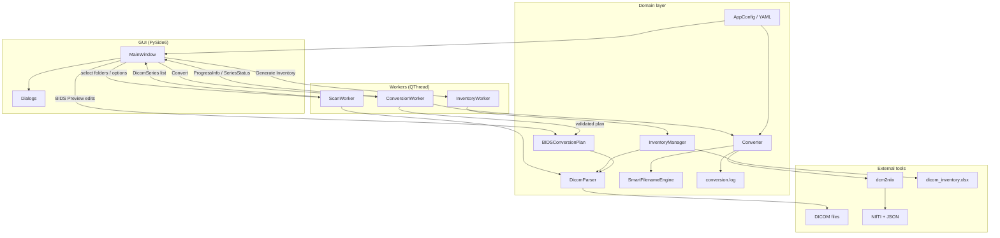

# Architecture

## High-level diagram



## Layers

1. **Presentation** – `gui/` renders state and collects user choices.
2. **Orchestration** – `workers/` + `ConversionManager` run the pipeline off the UI thread.
3. **Domain** – `dicom/`, `converter/`, `validation/`, `utils/`, `models/`.
4. **Infrastructure** – `config/`, `logging/`, bundled YAML, PyInstaller entrypoints.

## Conversion + validation flow

```
DICOM folder
    → ScanWorker / DicomParser (+ SequenceClassifier)
    → ConversionManager.prepare (dcm2niix, disk, output)
    → Converter / dcm2niix
    → NIfTI + sidecars
    → NiftiValidator / DiffusionValidator / MetadataValidator
    → conversion_report.html
```

## NeuroBIDS product architecture

```text
                NEUROBIDS
                    │
        ┌───────────┴───────────┐
        │                       │
   Deterministic Core       Copilot
        │                       │
   BIDS / DICOM / QC      Natural language
   validation / export       reasoning
        │                       │
        └───────────┬───────────┘
                    │
                ChangeSet
                    │
             Human approval
                    │
                  Apply
```

GUI stages: Discover → Map → Audit → Protect → Release. Conversion / Queue / Settings / Logs remain tools. See `docs/neurobids_workflow.md`.

The LLM never touches DICOM, the filesystem, or dcm2niix. It calls typed tools only.

## Design rules

- No `subprocess` calls from the GUI.
- No hardcoded naming rules.
- Dataclasses for transferable state.
- Exceptions in `utils/exceptions.py` map to user dialogs.
- Frozen vs source path resolution isolated in `config/paths.py`.

## Future modules (not implemented yet)

- `bids/` – BIDS layout export
- `qc/` – MRIQC / custom QC
- `reports/` – HTML/PDF session reports
