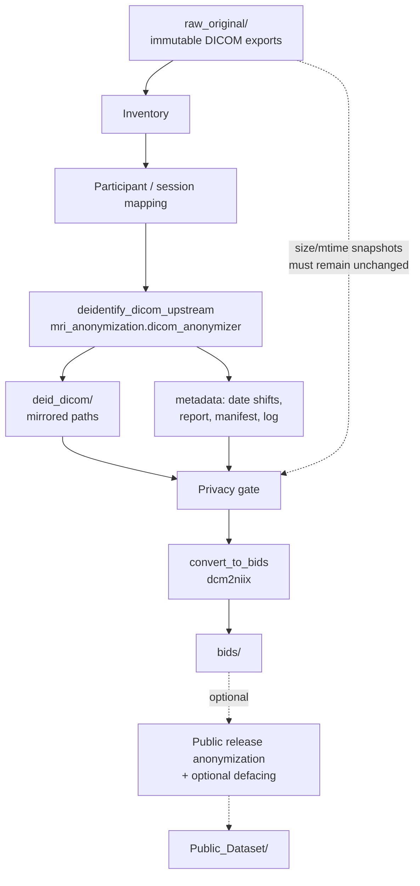

# De-identification / anonymization report

**Purpose:** Reconstruct the repository de-identification workflow for a Scientific Data Methods subsection.  
**Constraint:** Inspection only; no source files were modified to produce this report (this file is the sole deliverable).  
**Evidence date:** 2026-07-16.

**Primary code paths**
- Upstream research workflow: `neuro_pipeline/neuro_pipeline/deidentify_dicom_upstream.py` → `neuro_pipeline/deidentify/upstream.py` → `mri_anonymization/dicom_anonymizer.py`
- Tag policy: `mri_anonymization/constants.py`
- Validation: `mri_anonymization/dicom_validation.py`, `neuro_pipeline/deidentify/privacy_gate.py`, `neuro_pipeline/audit_deidentification.py`
- Optional public-release / defacing: `mri_anonymization/pipeline.py`, `neuro_pipeline/publication/release.py`, `mri_anonymization/defacing.py`
- Launch: `neuro_pipeline/run_deidentify.slurm`

---

# 1. Overview

## 1.1 Chronological research workflow

De-identification for conversion sits **after inventory/mapping** and **before BIDS conversion**:

1. **Inventory** — catalogue DICOM under `raw_original/` (`neuro_pipeline.inventory`).
2. **Mapping** — assign `participant_id` (`sub-XXX`), `canonical_subject_id` (e.g. `SUBC001`), and session paths (`generate_mapping` → `metadata/participant_mapping.csv`, `session_mapping.csv`, or Narval mapping CSVs).
3. **Upstream DICOM de-identification** — copy mapped session DICOM from `raw_original/` → `deid_dicom/`, applying PS3.15-oriented header edits (see §3). Source files are not overwritten.
4. **Privacy gate** — before conversion, `run_privacy_gate()` checks `deid_dicom`, report cleanliness, identity tags, and that snapshotted raw files are unchanged.
5. **BIDS conversion** — `convert_to_bids` defaults to reading **`deid_dicom/`** (raw only with `--allow-raw-input`).
6. **Optional separate public-release anonymization** — `mri_anonymization` / `run_release_pipeline` can re-pseudonymize a BIDS tree and optionally deface anatomicals for external sharing (not required for research conversion).

## 1.2 Directories

| Role | Path (Narval layout) |
|---|---|
| Input (immutable source) | `{DATA_ROOT}/raw_original/` (e.g. `/home/alexrees/scratch/raw_original`) |
| De-identified DICOM output | `{DATA_ROOT}/deid_dicom/` (mirror of relative paths under `raw_original`) |
| Mapping / reports | `{DATA_ROOT}/metadata/` (`deidentify_*.csv/json`, date shifts, logs) |
| Logs | `{DATA_ROOT}/logs/deidentify.log`, Slurm `logs/deid_*.out` |
| Subsequent BIDS output | `{DATA_ROOT}/bids/` (or legacy `raw_bids/`) |

Observed on disk: `deid_dicom/Control/...` exists with hierarchy matching `raw_original/Control/...`. Full-cohort completion artifacts (`deidentify_report.csv`, `deidentify_manifest.json`) were **not** present at inspection time; `deidentify_date_shifts.csv` and Slurm/logs indicate runs in progress or partial (e.g. subject filter / Control-only tree).

## 1.3 Workflow diagram



---

# 2. Software

| Item | Value found in repository / environment |
|---|---|
| **Primary engine** | Custom Python package **`mri_anonymization`** (version **2.0.0** in `mri_anonymization/__init__.py`) |
| **Orchestration** | `neuro_pipeline` module `deidentify_dicom_upstream` (pipeline version **2.1.0** in `neuro_pipeline.utils.extensions`) |
| **DICOM I/O library** | **pydicom** — runtime observed: **`3.0.2+computecanada`** |
| **UID / date helpers** | Custom: `UidRemapper` (SHA-256 → `2.25.*` UIDs), `date_shift.generate_date_shifts` |
| **Executable / entry point** | `python -m neuro_pipeline.deidentify_dicom_upstream` |
| **Slurm launcher** | `neuro_pipeline/run_deidentify.slurm` (`job-name=dicom_deidentify`) |
| **Not used for header de-id** | No `dcmodify`, `gdcmanon`, `dicom-anonymizer` CLI, or `DicomCleaner` invocations found |
| **Dependencies (code imports)** | `pydicom`, `pandas`, standard library (`hashlib`, `secrets`, …); defacing optionally needs `pydeface` or FSL `deface`/`fsl_deface` (**not on PATH** at inspection) |
| **Pinned requirements file** | No project-root `requirements.txt` / `environment.yml` listing pydicom was found under `neuro_pipeline/` |

**Calling chain**

```
run_deidentify.slurm
  → python -m neuro_pipeline.deidentify_dicom_upstream
    → run_upstream_deidentification()
      → process_dicom_file()  [mri_anonymization.dicom_anonymizer]
        → anonymize_dicom_dataset() + validate_anonymized_dicom()
```

---

# 3. DICOM header modifications

The anonymizer module docstring states processing is **“per PS3.15 Basic Application Level Confidentiality Profile.”** The implementation is a **custom subset** of that profile (explicit tag list + private-tag removal + date shift + UID remap), not a claim of full NEMA toolkit compliance. Method string written to DICOM:

`PS3.15 Basic Profile; pseudonym; date shift; UID remap`

Provenance tags set: `PatientIdentityRemoved = YES` `(0012,0062)`; `DeidentificationMethod` `(0012,0063)`.

## 3.1 Tag action table

| Tag | Keyword | Action | Reason (from code/comments) |
|---|---|---|---|
| (0010,0010) | PatientName | **Pseudonymized** → `canonical_subject_id` | Replace scanner/folder name with mapped canonical ID |
| (0010,0020) | PatientID | **Pseudonymized** → `canonical_subject_id` | Same |
| (0010,0030) | PatientBirthDate | **Cleared** (empty) | PHI |
| (0010,1000) | OtherPatientIDs | Cleared | PHI |
| (0010,1001) | OtherPatientNames | Cleared | PHI |
| (0010,2160) | EthnicGroup | Cleared | PHI |
| (0010,2180) | Occupation | Cleared | PHI |
| (0010,21B0) | AdditionalPatientHistory | Cleared | PHI |
| (0010,4000) | PatientComments | Cleared | PHI |
| (0010,0040) | PatientSex | **Preserved by default**; cleared if `--remove-sex` | Retained for BIDS `participants.tsv` |
| (0008,0080) | InstitutionName | Cleared | PHI |
| (0008,0081) | InstitutionAddress | Cleared | PHI |
| (0008,0090) | ReferringPhysicianName | Cleared | PHI |
| (0008,0092) | ReferringPhysicianAddress | Cleared | PHI |
| (0008,0094) | ReferringPhysicianTelephoneNumbers | Cleared | PHI |
| (0008,1048) | PhysiciansOfRecord | Cleared | PHI |
| (0008,1050) | PerformingPhysicianName | Cleared | PHI |
| (0008,1060) | NameOfPhysiciansReadingStudy | Cleared | PHI |
| (0008,1070) | OperatorsName | Cleared | PHI |
| (0008,1010) | StationName | Cleared | PHI |
| (0008,1030) | StudyDescription | Cleared | May contain PHI |
| (0008,0050) | AccessionNumber | Cleared | PHI |
| (0018,1000) | DeviceSerialNumber | Cleared | PHI |
| (0020,0010) | StudyID | Cleared | PHI |
| (0032,1032) | RequestingPhysician | Cleared | PHI |
| (0032,1060) | RequestedProcedureDescription | Cleared | PHI |
| (0040,0241) | PerformedStationAETitle | Cleared | PHI |
| (0040,0242) | PerformedStationName | Cleared | PHI |
| (0040,0243) | PerformedLocation | Cleared | PHI |
| (0040,A075) | VerifyingObserverName | Cleared | PHI |
| (0040,A123) | PersonName | Cleared | PHI |
| (0020,4000) | ImageComments | Cleared | PHI |
| (0032,4000) | StudyComments | Cleared | PHI |
| (4008,010C) | IdentifyingComments | Cleared | PHI |
| (4008,0111) | UniformResourceLocator | Cleared | PHI |
| (0008,0020) etc. | StudyDate / SeriesDate / AcquisitionDate / ContentDate / InstanceCreationDate / PPS dates | **Date-shifted** (per-subject offset) | Remove absolute calendar dates; keep relative intervals |
| (0008,002A) | AcquisitionDateTime | Date-shifted | Same |
| (0008,0030) etc. | StudyTime / SeriesTime / AcquisitionTime / ContentTime / PPS times | **Preserved** (TM not shifted) | PS3.15-oriented time policy in constants |
| (0020,000D) | StudyInstanceUID | **Remapped** (deterministic SHA-256 → `2.25.*`) | Break linkage |
| (0020,000E) | SeriesInstanceUID | Remapped | Break linkage |
| (0008,0018) | SOPInstanceUID | Remapped | Break linkage |
| (0002,0003) | MediaStorageSOPInstanceUID | Remapped to match SOPInstanceUID | File-meta consistency |
| (0020,0052) | FrameOfReferenceUID | Remapped | Break linkage |
| (0008,1155) | ReferencedSOPInstanceUID | Remapped | Nested references |
| Other UI VR (except SOP Class) | various | Remapped recursively | Prevent UID leakage |
| (0008,0016) | SOPClassUID | **Preserved** | Standard class must not change |
| Odd-group private tags | (private) | **Removed** (`Dataset.remove_private_tags()`) | PHI / vendor private data |
| Pixel data | (7FE0,0010) | **Not modified** in anonymizer | Header-only de-id |

Empirical check (`SUBC01` session, B1 map series): raw `PatientName=SUB050_ControlSubject_2023MAY05` → deid `SUBC001`; `StudyDate 20230505` → `20141212`; UIDs remapped to `2.25.*`; `SeriesDescription` and `RepetitionTime`/`EchoTime` retained; private tags count 0.

---

# 4. Preserved metadata

There is **no explicit whitelist** of “keep for dcm2niix” tags. Preservation is by **omission** from the clear/pseudonym/UID/date lists, plus private-tag removal. Intentionally or effectively retained for processing (confirmed by code and/or sample):

| Metadata | Role |
|---|---|
| SeriesDescription `(0008,103E)` | BIDS modality/task/dir heuristics in `convert_to_bids` |
| ProtocolName, SequenceName, and other non-PHI acquisition tags | dcm2niix / inventory |
| RepetitionTime, EchoTime, FlipAngle | fMRI / anatomical processing |
| PixelSpacing, SliceThickness, Rows/Columns, ImageOrientationPatient, ImagePositionPatient | Geometry, fieldmap/DWI processing |
| PhaseEncodingDirection / related Siemens fields **if stored in standard (non-private) tags** | Distortion correction — **private CSA tags are removed**, which may strip some Siemens-specific detail |
| Acquisition/Study/Series **times** (TM) | Ordering within a day |
| PatientSex (default) | `participants.tsv` sex column |
| SOPClassUID | Valid DICOM / converter compatibility |
| Pixel data | Image content for conversion |
| Number of frames / DICOM file structure | Volume reconstruction |

**Cleared despite possible utility:** `StudyDescription` (pipeline uses series description instead).

**Risk note:** Removing **all private tags** can drop Siemens CSA fields that dcm2niix sometimes uses for slice timing, multiband factor, or effective echo spacing. The repository does not document a private-tag allowlist.

---

# 5. Pseudonymization

## 5.1 Identifiers in the research pipeline

Two related ID layers exist:

| Layer | Format (example) | How assigned | Where used in de-id |
|---|---|---|---|
| `canonical_subject_id` | `SUBC001`, `SUBON…`, `SUBG…` | Derived from inventory/folder naming + overrides in mapping tables | Written into DICOM **PatientName** and **PatientID** |
| `participant_id` | `sub-001`, `sub-002`, … | **Sequential** assignment during mapping (`sub-{index:03d}` per METHODS_BIDS / `participant_mapping.csv`) | Recorded in de-id **report CSV**; used later for BIDS paths — **not** written into DICOM PatientID by upstream de-id |

**Upstream de-identification does not hash PatientID.** It **replaces** PatientName/PatientID with the mapped **`canonical_subject_id`** read from the mapping table (`visit.canonical_subject_id` passed into `process_dicom_file`).

Date-shift offsets are keyed by that same canonical ID (`metadata/deidentify_date_shifts.csv` example: `SUBC001,-3066`).

## 5.2 Public-release remapping (separate)

`mri_anonymization.subject_id.build_subject_mappings` assigns new IDs `sub-0001`, `sub-0002`, … in sorted order for a **public** BIDS copy. That stage is **not** the upstream `raw_original → deid_dicom` step.

## 5.3 UID remapping

Per-subject `UidRemapper(namespace=canonical_subject_id)` maps each original UID deterministically via SHA-256(`namespace|original_uid`) → `2.25.{integer}` (truncated to 64 chars). Same original UID maps consistently within a subject.

---

# 6. File integrity

| Question | Finding |
|---|---|
| Pixel data modified? | **No** in DICOM anonymizer (`dataset.copy()`; pixels read; no deface at this stage) |
| Private tags removed? | **Yes** |
| UIDs regenerated? | **Yes** (deterministic remap; SOP Class preserved) |
| Checksums verified? | **Partial:** privacy gate compares **size + mtime_ns** snapshots of source files from the manifest — not cryptographic pixel checksums. Mapping uses `source_hash` for identity provenance separately |
| Original filenames changed? | **No** — destination keeps the same basename (e.g. `SUB050_CONTROLSUBJECT_2023MAY05....IMA`) |
| Directory hierarchy preserved? | **Yes** — `deid_dicom / <relative path under raw_original>` |
| Atomic write? | Yes — write `*.tmp.<pid>` then replace |
| Non-DICOM files | Skipped (not copied into `deid_dicom` by upstream runner) |

**Implication:** Filenames and folder names under `deid_dicom` may still contain date tokens or scanner-style subject strings even after header de-identification.

---

# 7. Raw data preservation

| Question | Finding |
|---|---|
| Original DICOM untouched? | **Yes by design** — writes only under `deid_dicom/`; docstring and privacy gate assert source immutability |
| De-id on copies? | **Yes** — new files written to `deid_dicom` |
| Immutable raw location | `raw_original/` (also accept `raw_data/` naming in path helpers) |
| Provenance preserved? | Manifest stores `dataset_source_root`, `deid_dicom`, counts, optional `subject_filter`, and `raw_original_snapshots` (path → size/mtime). Per-file CSV report columns include source/output paths, original Study/Series UIDs, shift_days, status. Date-shift table kept under `metadata/` (private; not for public release) |

---

# 8. Facial anonymization

| Tool / method | In upstream DICOM de-id? | Elsewhere in repo? |
|---|---|---|
| pydeface | **No** | Optional (`mri_anonymization.defacing`, `neuro_pipeline.publication.defacing`) |
| fsl_deface / `deface` | **No** | Fallback if pydeface missing |
| mridefacer | **Not found** | — |
| FreeSurfer / ANTs deface | **Not found** as defacing drivers | — |
| Skull stripping as anonymization | **Not found** | — |

**Upstream research de-identification performs header-based anonymization only; no image-based facial anonymization is applied in that step.**

Defacing is available for **anatomical NIfTI** during optional public release (`enable_defacing`; OpenNeuro mode can auto-enable when anatomicals are present). Default `AnonymizationConfig.enable_defacing = False`. At inspection, `pydeface` / `fsl_deface` were **not** found on `PATH`, and no completed public defacing derivatives were required for this report.

---

# 9. Validation

| Mechanism | What it does |
|---|---|
| **Per-file validation** (`validate_anonymized_dicom`) | PatientName/ID match pseudonym; PHI list empty; no private tags; PatientIdentityRemoved=YES; UIDs remapped/valid; dates shifted; MediaStorageSOPInstanceUID consistency; warn/fail on BurnedInAnnotation / overlays |
| **Failed write prevention** | File not written if validation fails; run raises `FatalPipelineError` if any DICOM fails |
| **Privacy gate** (pre-BIDS) | `deid_dicom` exists; raw snapshots unchanged; report has zero `failed` rows; sample/all deid files have allowed identities and cleared forbidden PHI tags |
| **Privacy audit** (`audit_deidentification`) | Read-only raw vs deid comparison for one subject → `privacy_audit_<subject>.json/.csv` |
| **Stage validator** (`DeidentificationValidator`) | Checks report/manifest artifacts |
| **Preflight** | `scripts/preflight_deidentification.py` → `metadata/preflight_deidentification_report.txt` |
| **Logging** | `logs/deidentify.log`, Slurm stdout/err, structured report CSV |
| **Tests** | `tests/test_deidentify_dicom_upstream.py`, `test_deidentify_narval_inputs.py`, `test_audit_deidentification.py` |

Burned-in pixel PHI is **detected/warned/failed via tags**, not by OCR of pixels.

---

# 10. Manuscript-ready description

DICOM de-identification was implemented as a dedicated upstream stage of the research pipeline (`neuro_pipeline.deidentify_dicom_upstream`), applied to mapped session directories under `raw_original/` and writing a parallel tree to `deid_dicom/` without modifying the original exports. Header anonymization was performed with a custom Python module (`mri_anonymization`, using pydicom) designed around the DICOM PS3.15 Basic Application Level Confidentiality Profile. Direct identifiers (including patient name and patient ID) were replaced with the participant’s mapped canonical study identifier; additional demographic, institutional, physician, accession, device-serial, and free-text comment fields on a fixed tag list were cleared; all private DICOM tags were removed; Study, Series, SOP, and related UIDs were deterministically remapped; and calendar dates were shifted by a reproducible per-participant day offset while acquisition times were left unchanged. Patient sex was retained by default for demographic metadata. Pixel data were not altered at this stage, and facial defacing was not part of the DICOM de-identification step. Outputs were validated per file before writing, with subsequent privacy-gate checks required before BIDS conversion, which by default consumes `deid_dicom/` rather than the raw archive. Optional image defacing and further public-release remapping are implemented separately for external sharing and were not required for research BIDS conversion.

---

# 11. Missing information

| Missing detail | Likely location | How to verify |
|---|---|---|
| Whether full-cohort de-id completed (all cohorts under `deid_dicom`, final report/manifest) | `deid_dicom/*`, `metadata/deidentify_report.csv`, `deidentify_manifest.json`, Slurm `logs/deid_*.out` | Confirm artifacts exist and success counts match 135 sessions |
| Exact seed used for production date shifts | Slurm script shows `--seed 42`; confirm job that wrote `deidentify_date_shifts.csv` | Diff job command lines vs CSV timestamps |
| Formal PS3.15 profile options applied (Clean Pixel Data Option, etc.) | Not enumerated beyond Basic Profile string | Compare `constants.PHI_DICOM_TAGS` to NEMA PS3.15 Annex E; document gaps |
| Impact of private-tag removal on dcm2niix sidecars (SliceTiming, MultibandAccelerationFactor, EffectiveEchoSpacing) | Compare JSON from raw vs deid conversion | Convert matched series from both roots; diff sidecars |
| Whether filename/path tokens (dates, `CONTROLSUBJECT`) are acceptable for the intended share level | Policy / DUA | Manual review of `deid_dicom` pathnames |
| Public-release anonymization / defacing actually run for this dataset | `Public_Dataset/`, release logs, defacing reports | Search derivatives; check `enable_defacing` job history |
| Locked dependency pin for pydicom in repo | Missing requirements file | Capture `pip freeze` / module load environment used on Narval |
| Docker/Singularity recipe for de-id | Not found for this stage | Confirm if any container module is used outside repo |
| Burned-in PHI prevalence in real data | Privacy audit / BurnedInAnnotation failures | Run `audit_deidentification` on each cohort sample |
| Mapping between `canonical_subject_id` and public `sub-XXXX` if release remapping used | Private subject mapping CSV from `mri_anonymization` | Only if public release stage executed |

---

## Source index

| Path | Role |
|---|---|
| `mri_anonymization/dicom_anonymizer.py` | Core tag/UID/date anonymization |
| `mri_anonymization/constants.py` | PHI / date / UID tag lists; PS3.15 method string |
| `mri_anonymization/uid_remapper.py` | Deterministic UID remap |
| `mri_anonymization/date_shift.py` | Per-subject day offsets |
| `mri_anonymization/dicom_validation.py` | Per-file validation |
| `mri_anonymization/defacing.py` | Optional NIfTI defacing (not upstream DICOM) |
| `neuro_pipeline/deidentify/upstream.py` | raw → deid orchestration |
| `neuro_pipeline/deidentify_dicom_upstream.py` | CLI entry |
| `neuro_pipeline/deidentify/privacy_gate.py` | Pre-conversion gate |
| `neuro_pipeline/audit_deidentification.py` | Post-hoc privacy audit |
| `neuro_pipeline/convert_to_bids.py` | Requires `deid_dicom` by default |
| `neuro_pipeline/run_deidentify.slurm` | HPC launch |
| `docs/METHODS_BIDS.md` | Manuscript-oriented conversion narrative |
| `metadata/deidentify_date_shifts.csv` | Generated shift table (present) |
| `deid_dicom/` | De-identified DICOM mirror (partial Control tree observed) |
